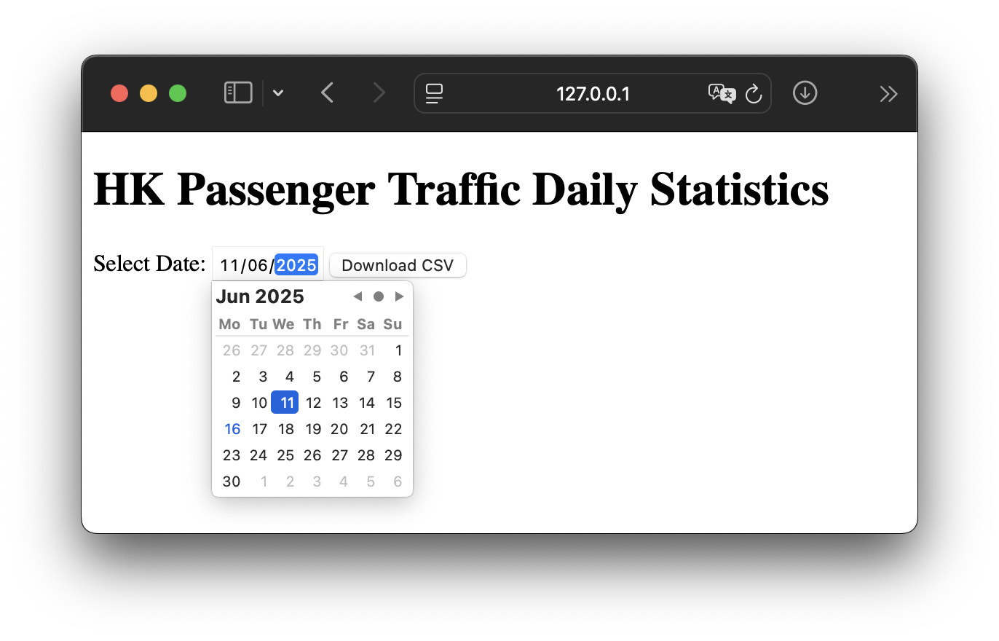

# Hong Kong Passenger Traffic csv Exporter

~App link: [https://hkp-pt-daily-data.up.railway.app/](https://hkp-pt-daily-data.up.railway.app/)~ (Out of free budget)

csv exporter for [Hong Kong daily passenger traffic data](https://data.gov.hk/en-data/dataset/hk-immd-set5-statistics-daily-passenger-traffic).

## To use the code

```bash
python3 grapher.py --date={dd-mm-yyyy} --mode{mode} --output={name}
```

Example, default value are provided for empty arguments.

```bash
python3 grapher.py --date=17-02-2025
```

check `data/` directory to see the output file.

To run as a flask application, ensure it is installed and run

```bash
flash run
```



## Requirements

Python 3.13.1

use requirements.txt (pip3)
